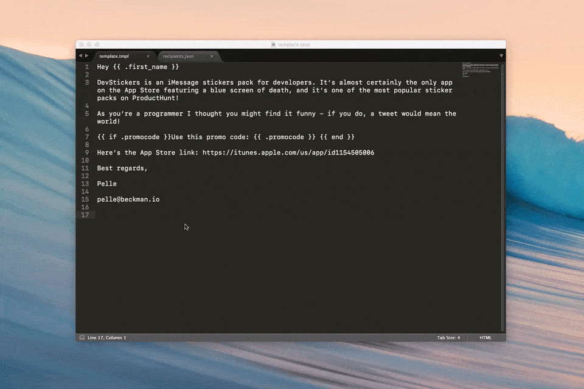

# enmasse

`enmasse` (/ɑn ˈmæs/) is a utility application for creating Gmail draft emails compiled from [golang templates](https://golang.org/pkg/text/template/) and JSON data.

enmasse is a very useful tool when you need to write almost-identical emails for a large group of recipients, but using a newsletter service like MailChimp would be overdoing it. Journalist reachouts, job applications, or promo code distribution are great usage examples.



Created by Pelle Beckman, [beckman.io](http://beckman.io)

**ProTip:** use [Boomerang for Gmail](http://www.boomeranggmail.com/) for scheduling emails.

**Please don’t use enmasse for sending spam!**

## Installation

enmasse uses the Gmail APIs which require you to generate a personal credentials file.

* [Use this wizard](https://console.developers.google.com/start/api?id=gmail) to create or select a project in the Google Developers Console and automatically turn on the API. Click **Continue**, then **Go to credentials**.
* On the **Add credentials to your project page**, click the **Cancel** button.
* At the top of the page, select the **OAuth consent screen tab**. Select an **Email address**, enter a **Product name** if not already set, and click the **Save** button.
* Select the **Credentials** tab, click the **Create credentials** button and select **OAuth client ID**.
* Select the application type **Other**, enter the name "Gmail API enmasse", and click the **Create** button.
* Click **OK** to dismiss the resulting dialog.
* Click the **Download JSON** button to the right of the client ID.
* Move this file to the same directory as the enmasse binary and rename it client_secret.json.

*On first run enmasse will ask you to perform a one-time authentication*

### macOS

[Binaries for macOS are available here](https://github.com/pbeck/enmasse/releases)

### Linux & Windows

Usage on linux or windows currently requires building from source.

`go build`

## Example usage

`enmasse -template=template.tmpl -data=addresses.json`

**addresses.json:**

```
[{
    "first_name": "Alistair",
    "email": "alistair.hennessey@gmail.com",
    "subject": "DevStickers",
    "promocode": "L327GF11"
}, {
	"first_name": "Klaus",
    "email": "klaus.daimler@gmail.com",
    "subject": "DevStickers",
    "promocode": "WH1S4KRS"
}, {
    "first_name": "Ned",
    "email": "ned.plimpton@gmail.com",
    "subject": "DevStickers",
    "promocode": "AAC568FH"
}]
```

**template.txt:**


```
Hey {{ .first_name }}

DevStickers is an iMessage stickers pack for developers. It’s almost certainly
the only app on the App Store featuring a blue screen of death, and it’s one
of the most popular sticker packs on ProductHunt!

As you’re a programmer I thought you might find it funny!
If you do, a tweet would mean the world! 

{{ if .promocode }}Use this promo code: {{ .promocode }} {{ end }}

Here’s the App Store link: https://itunes.apple.com/us/app/id1154505006 

Best regards,

Pelle

pelle@beckman.io
```

    
## Flags

    -template=FILE    Template file
    -data=FILE        JSON data file

## Scheduling messages

A built-in scheduling function would be nice, but **a)** I feel it’s out of scope, **b)** it would require a lot of work and most likely require a backend of some sort, and  **c)** [Boomerang for GMail](http://www.boomeranggmail.com/) seems to work like a charm.

## Contributing

Please report bugs or feature requests in the [issue tracker at GitHub](https://github.com/pbeck/enmasse/issues).

## License

The MIT License (MIT)

Copyright (c) 2016 Pelle Beckman, http://beckman.io

Permission is hereby granted, free of charge, to any person obtaining a copy of this software and associated documentation files (the "Software"), to deal in the Software without restriction, including without limitation the rights to use, copy, modify, merge, publish, distribute, sublicense, and/or sell copies of the Software, and to permit persons to whom the Software is furnished to do so, subject to the following conditions:

The above copyright notice and this permission notice shall be included in all copies or substantial portions of the Software.

THE SOFTWARE IS PROVIDED "AS IS", WITHOUT WARRANTY OF ANY KIND, EXPRESS OR IMPLIED, INCLUDING BUT NOT LIMITED TO THE WARRANTIES OF MERCHANTABILITY, FITNESS FOR A PARTICULAR PURPOSE AND NONINFRINGEMENT. IN NO EVENT SHALL THE AUTHORS OR COPYRIGHT HOLDERS BE LIABLE FOR ANY CLAIM, DAMAGES OR OTHER LIABILITY, WHETHER IN AN ACTION OF CONTRACT, TORT OR OTHERWISE, ARISING FROM, OUT OF OR IN CONNECTION WITH THE SOFTWARE OR THE USE OR OTHER DEALINGS IN THE SOFTWARE.
